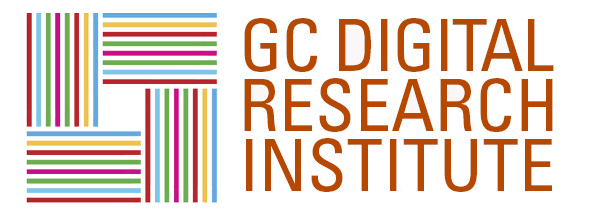
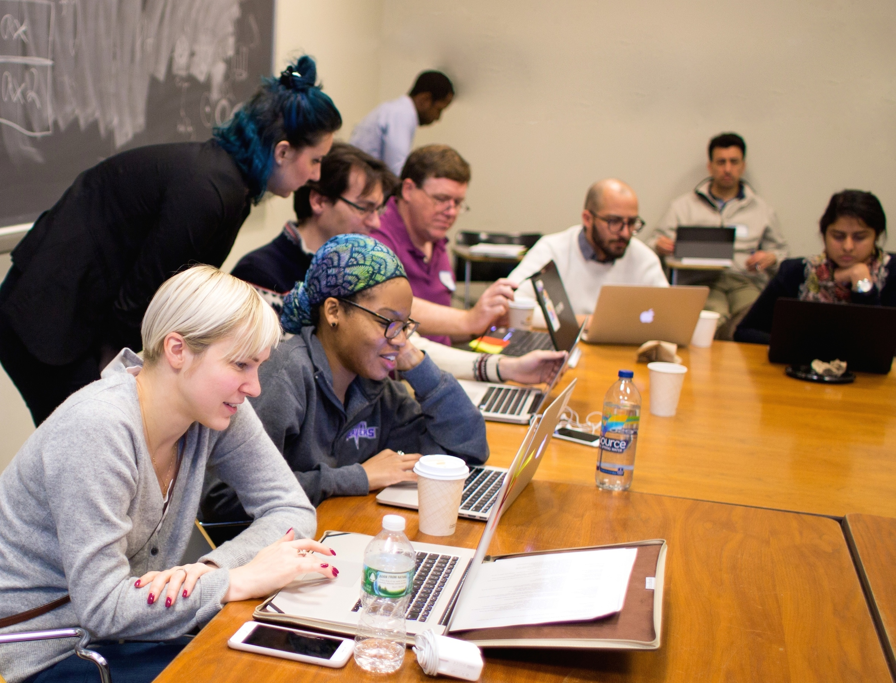

# Overview

The GC Digital Research Institute (GCDRI) is a week-long course in digital research methods held at [The Graduate Center, CUNY](https://www.gc.cuny.edu/Home). Organized by [Graduate Center Digital Initiatives](https://gcdi.commons.gc.cuny.edu/) (GCDI), this intensive course is designed to provide an accessible introduction to technologies frequently used in serious digital research, including the command line, databases, the Python programming language, and the git version control system. Building on these core skills, later sessions in the GCDRI focus on more specialized approaches, such as natural language processing, machine learning, mapping, and data collection with APIs.

This document provides a high-level overview of the GCDRI pedagogical model and presents the curriculum from the core and supplementary technical sessions. It also collates informational sessions on critical skills such as grant writing, sustainability, time management, and outreach.

# Background

The GCDRI grew out of the work of the [Digital Fellows](https://digitalfellows.commons.gc.cuny.edu/), an interdisciplinary team of graduate students dedicated to developing and supporting digital approaches to research and pedagogy at the Graduate Center. The Fellows hold office hours, work with students and faculty, and lead a popular series of technical workshops each semester. Through this work, the Fellows became conscious of a need for a more sustained approach to teaching digital methods. While workshops, and workshop series, were well-received, there was little room during a busy semester to build the fundamental competencies that serve as a foundation for sustained inquiry and scholarship using digital methods. 

In recent years, alternative models for collaboration and pedagogy such as bootcamps, sprints, and hackathons have become the norm in the technology industry. These approaches emphasize close collaboration and sustained, intensive effort over a short period of time to reach a desired goal. For sprints and hackathons, this can be the creation of a project or feature over the course of a few hours or days. For bootcamps, the goal is usually to train participants in specialized technical skills in the space of a few weeks or months. Though some bootcamps and hackathons have been criticized for their overt commercialization and exploitative practices, these models have also been embraced by nonprofits and the open source community. 

The intensive pedagogical model has also been taking root within the academy. The nonprofit [Software Carpentry Foundation](http://software-carpentry.org/scf/), for example, teaches technical skills useful in the sciences. In addition, organizations such as [Humanities Intensive Teaching and Learning](http://www.dhtraining.org/hilt/) (HILT) and the [Digital Humanities Summer Institute](http://www.dhsi.org/) (DHSI) offer intensive courses for practitioners in the digital humanities, often with a conference component.

Inspired by these models of intensive training both in and out of the academy, and with the generous assistance of a CUNY Strategic Investment Initiative grant, GCDI introduced the Digital Research Institute in summer 2015. Heavy demand for placement led to an expansion of the Institute from 30 participants in 2015 to 60 in summer 2016. The Institute, reflecting the interdisciplinary concerns of GCDI and the Digital Fellows, was designed to engage scholars in the sciences, social sciences, and  humanities. This is achieved by combining a foundational core in four flexible and widely used technologies with supplemental sessions in areas of more specialized interest. The Institute also emphasizes skills that contribute to the growth of a community of sustainable digital practice at the GC, offering workshops on outreach, grant writing, and project life cycle management. 
  

